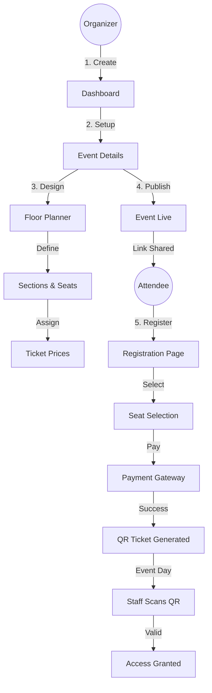
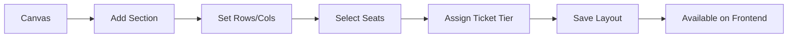

# Event Planner Application - User Manual & Workflow Guide

This document outlines the workflows for all user roles within the Event Planner application.

---

## 1. 👑 Platform Owner (Super Admin)
**Role:** The system owner who manages the entire infrastructure, tenants, and global settings.

### **Workflow: System Management**
1.  **Login**: Access the application via the `/admin` route (if configured) or standard login with Super Admin credentials.
2.  **Tenant Management**:
    *   **Create Tenant**: Onboard new organizations (e.g., "Google", "Microsoft") that will host their own events.
    *   **Suspend/Activate**: Manage the status of existing tenants.
3.  **User Oversight**: View all users across the platform, manage permissions, and handle support requests.
4.  **Global Settings**: Configure payment gateways (Stripe/Razorpay), email servers (SMTP), and feature flags.

---

## 2. 🏢 Admin / Organizer (Tenant Owner)
**Role:** The primary event creator and manager for an organization. You have full control over your events.

### **Workflow A: Creating an Event**
1.  **Dashboard**: Log in and land on the Organizer Dashboard.
2.  **Start Creation**: Click **"Create Event"**.
3.  **Basic Details**:
    *   Enter **Event Name**, **Date & Time**, and **Location/Venue**.
    *   Select **Event Type** (Conference, Concert, etc.) and **Visibility** (Public/Private).
4.  **Save Draft**: The event is created in "Draft" mode.

### **Workflow B: Configuring the Floor Plan (For Seated Events)**
*Critical for concerts, galas, and conferences with assigned seating.*

1.  **Navigate**: Go to **Event Dashboard > Floor Planner**.
2.  **Setup Sections**:
    *   Drag and drop **Sections** (e.g., "VIP Area", "Balcony") onto the canvas.
    *   Configure rows and columns (e.g., 10 rows x 20 seats).
3.  **Pricing & Tiers**:
    *   Create **Ticket Classes** (e.g., "Gold - $100", "Silver - $50").
    *   Select a group of seats on the map and assign them a Ticket Class.
4.  **Objects**: Add stage, exits, and bars to the map for visual reference.
5.  **Save**: Click **Save Layout** to publish the seat map to the registration page.

### **Workflow C: Publishing & Inviting**
1.  **Publish**: When ready, change status from **Draft** to **Published**.
2.  **Public Registration**: Share the public link (e.g., `/events/123/register`).
3.  **Team Invites**:
    *   Go to **Team Members**.
    *   Click **Invite Member**.
    *   Enter email and assign role (**Manager/Staff**).
    *   *Note: Managers can edit events; Staff usually help with check-in.*

---

## 3. 👔 Manager / Staff (Event Team)
**Role:** Helping hands who manage day-to-day operations or event-day logistics.

### **Workflow A: Managing Registrations**
1.  **View List**: Go to **Event Dashboard > Registrations**.
2.  **Search/Filter**: Find attendees by name, email, or ticket type.
3.  **Actions**:
    *   **Approve/Reject**: If the event requires approval.
    *   **Export**: Download the attendee list as CSV for external use.

### **Workflow B: Event Day Check-in**
*Your primary task on the day of the event.*

1.  **Open Scanner**: Navigate to `/events/[id]/checkin` on your mobile device or laptop.
2.  **Scan Mode**:
    *   Click **"Scan QR Code"**.
    *   Point camera at attendee's ticket.
    *   System beeps and shows **"Checked In ✅"** or **"Already Used ❌"**.
3.  **Manual Mode**:
    *   If a user forgot their ticket, search their name in the list.
    *   Click **"Check In"** manually.

---

## 4. 👤 User / Attendee
**Role:** The end-user who registers and attends events.

### **Workflow A: Registration (How to Register)**
1.  **Discover**: Land on the event page via a link or the "Explore" page.
2.  **Click Register**:
    *   **Scenario 1: Simple Event**: Fill in Name/Email -> Pay -> Done.
    *   **Scenario 2: Seated Event**:
        *   Click **"Select Seats"**.
        *   Interactive map opens. Hover to see prices.
        *   Click seats to add to cart.
        *   Click **"Proceed"**.
3.  **Checkout**:
    *   Enter attendee details (Name, Job Title, etc.).
    *   **Promo Code**: Enter code (e.g., "EARLYBIRD") and click Apply.
    *   **Pay**: Complete payment via Credit Card/UPI.
4.  **Confirmation**:
    *   Receive confirmation email with **QR Code Ticket**.
    *   View ticket in "My Tickets" section on the platform.

### **Workflow B: Attending**
1.  **Arrival**: Show the QR code from the email or app at the entrance.
2.  **RSVP**: (Optional) Click "Interested" on event pages to save them to your list.

---

## 5. Visual Diagrams

### Event Creation to Completion Flow

### Floor Planner Logic

