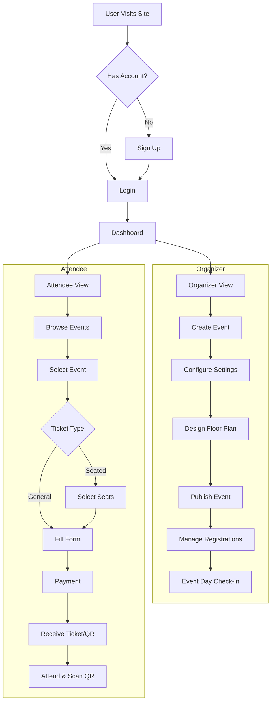
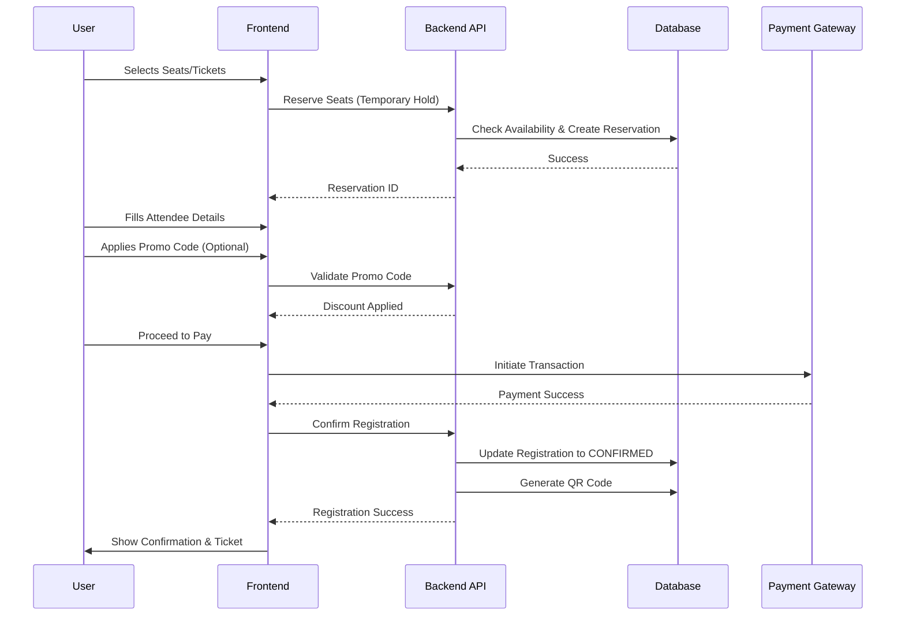
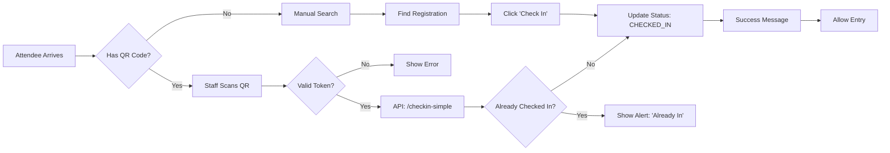

# Event Planner Application Documentation

## 1. Overview
The Event Planner Application is a comprehensive platform for managing events, from initial creation and planning to registration, ticketing, and event-day operations. It supports various user roles, complex seat selection, and QR-code based check-in.

## 2. User Roles
*   **Super Admin**: Full access to all tenants and system settings.
*   **Admin/Organizer**: Manages events, team members, and settings within a specific tenant/organization.
*   **User/Attendee**: Browse events, register, purchase tickets, and attend events.

## 3. Core Modules & Workflow

### 3.1 Authentication & Onboarding
*   **Login/Signup**: Users can sign up using email or social providers (if configured).
*   **Tenant Selection**: Upon login, users may be prompted to select or create a tenant (organization) if they belong to multiple.
*   **Dashboard**: The central hub showing upcoming events, analytics, and quick actions.

### 3.2 Event Management (Organizer Workflow)
1.  **Create Event**:
    *   Basic Details: Name, Date, Time, Venue/Location.
    *   Event Type: Conference, Workshop, Concert, etc.
    *   Visibility: Public or Private.
2.  **Event Configuration**:
    *   **Floor Plan**: Design the venue layout using the Floor Planner tool.
    *   **Tickets & Seats**: Define ticket classes (VIP, General) and map them to the floor plan.
    *   **Promo Codes**: Create discount codes with limits and expiration dates.
    *   **Team**: Invite team members to help manage the event.
    *   **Registration Forms**: Customize the data collected from attendees.
3.  **Publishing**: Make the event live for public or invite-only registration.

### 3.3 Registration Flow (Attendee Workflow)
1.  **Event Page**: Users view event details, speakers, and schedule.
2.  **Registration**:
    *   **Simple Registration**: Fill details and pay (for non-seated events).
    *   **Seat Selection**: For seated events, users view the interactive floor plan, select available seats, and proceed.
    *   **Promo Codes**: Users can apply valid promo codes during checkout.
3.  **Payment**: Secure payment processing (verified via Stripe/Payment Gateway).
4.  **Confirmation**:
    *   Success page with Order Summary.
    *   Email confirmation with **QR Code** and ticket details.
    *   RSVP status updated.

### 3.4 Event Day Operations
1.  **Check-in**:
    *   **QR Scan**: Staff use the Check-in Scanner (web/mobile) to scan attendee QR codes.
    *   **Manual Check-in**: Search attendees by name/email and manually mark them as checked in.
    *   **Status Update**: System updates `checkInStatus` to `CHECKED_IN` and records timestamp.
2.  **Badge Printing**: (Optional) Print badges for checked-in attendees.

## 4. Workflow Diagrams

### 4.1 High-Level Application Flow

### 4.2 Registration & Payment Flow

### 4.3 Check-in Flow

## 5. Technical Stack
*   **Frontend**: Next.js (React), Tailwind CSS
*   **Backend**: Next.js API Routes, Spring Boot (Java) Service
*   **Database**: PostgreSQL, Prisma ORM
*   **Authentication**: NextAuth.js
*   **Infrastructure**: Docker

## 6. Directory Structure Key
*   `/apps/web/app/events/[id]/manage`: Organizer dashboard for specific event.
*   `/apps/web/app/events/[id]/register`: Public registration page.
*   `/apps/web/app/events/[id]/event-day/check-in`: QR Code scanner tool.
*   `/apps/web/app/api/`: Backend API routes.
